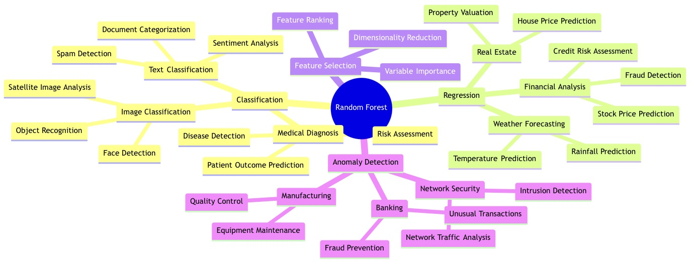
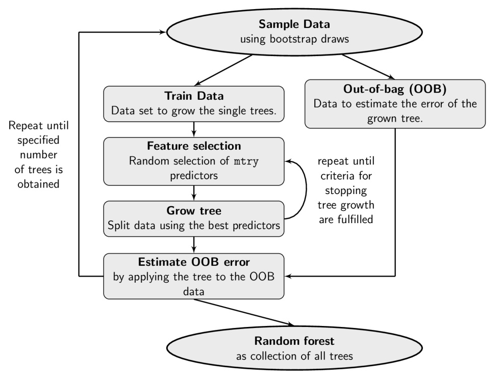

# 랜덤 포레스트 알고리즘 원리 분석 및 구현  
https://youtu.be/nk2exzYEXhM?si=N8Gk4IOuXLMExMIs

## 1 서론

### 1.1 연구 배경 및 의의

RF는 분류 및 회귀에 사용되는 앙상블 학습 방법입니다.Breiman(2001)이 개발한 이 방법은 Breiman의 배깅 샘플링 접근 방식(1996a)과 Ho(1995; 1998)와 Amit과 Geman(1997)이 독립적으로 도입한 무작위 기능 선택을 결합하여 통제된 변동이 있는 결정 트리 컬렉션을 구성합니다.배깅을 사용하여 앙상블의 각 결정 트리는 훈련 데이터의 복원 샘플을 사용하여 구성됩니다.통계적으로 샘플은 샘플에서 적어도 한 번 나타나는 인스턴스의 약 64%를 가질 가능성이 높습니다.샘플의 인스턴스는 인백 인스턴스라고 하며 나머지 인스턴스(약 36%)는 아웃오브백 인스턴스라고 합니다.앙상블의 ​​각 트리는 레이블이 없는 인스턴스의 클래스 레이블을 결정하는 기본 분류기 역할을 합니다. 이는 각 분류자가 예측된 클래스 레이블에 대해 한 표를 던진 다음 가장 많은 표를 얻은 클래스 레이블을 사용하여 인스턴스를 분류하는 다수결 투표를 통해 수행됩니다.

RF와 다수결 투표를 설명하기 위해 8개의 샘플과 4개의 특징으로 구성된 표 1에 나와 있는 교육 데이터를 고려합니다. RF는 다른 특징인 Outlook, HWDone 및 Weekend에 대한 미리 정의된 값을 고려하여 어린이가 놀 수 있는지 여부를 결정하는 Play 특징의 값을 예측하기 위해 생성됩니다. 예를 들어, 주말이든 주중이든 맑은 날에 숙제를 마쳤다면 어린이가 놀 수 있다는 것은 교육 데이터에서 분명합니다. 숙제를 마쳤더라도 비오는 주중에는 놀 수 없습니다. 새로운 샘플을 분류하는 데 도움이 되도록 그림 3과 같이 3개의 트리로 구성된 RF가 생성되었습니다. 표 2는 샘플을 분류하기 위해 투표를 한 결과(rainy, false, true,?)를 보여줍니다. 여기서 ? 표시는 결정할 Play 특징의 값을 나타내는 데 사용됩니다. 표 2에서 보듯이, 나무 A와 C는 "예"에 투표했고, 나무 B는 "아니오"에 투표했습니다. 다수결 투표에 의해 승리한 투표는 따라서 "예"입니다(어린이가 놀 수 있습니다!).

| Outlook | HWDone | Weekend | Play |
|---------|---------|---------|------|
| Sunny | True | True | Yes |
| Sunny | True | False | Yes |
| Sunny | False | True | Yes |
| Sunny | False | False | No |
| Rainy | True | True | Yes |
| Rainy | True | False | No |
| Rainy | False | True | Yes |
| Rainy | False | False | No |

표 1-1. 훈련 데이터

  
  
그림 1-1. 세 그루의 나무 랜덤 포레스트

| Tree | Vote |
|------|------|
| A    | Yes  |
| B    | No   |
| C    | Yes  |

표 1-2. 투표 결과

빅데이터 시대를 맞이하여 고차원 특징, 비선형 관계 및 복잡한 노이즈 등의 도전과제에 직면하면서, 전통적인 단일 분류기로는 이상적인 성능을 얻기 어려워졌습니다. 랜덤 포레스트는 여러 의사결정 트리 분류기를 결합하고, 랜덤 특징 선택과 샘플링 메커니즘을 도입함으로써 모델의 일반화 능력을 향상시키는 동시에 강력한 노이즈 저항성과 특징 선택 능력을 보여주고 있습니다.

이론 연구와 실제 응용의 관점에서 볼 때, 랜덤 포레스트는 우수한 성능과 해석 가능성으로 인해 의료 진단, 금융 리스크 관리, 이미지 인식 등 다양한 분야에서 충분히 검증되고 실천되었습니다. 랜덤 포레스트 알고리즘의 수학적 원리를 체계적으로 검토하고 다양한 응용 시나리오에서의 성능 특성을 실험 분석과 결합함으로써, 이 중요한 기계학습 방법을 더 잘 이해하고 파악할 수 있습니다. 본 논문은 랜덤 포레스트의 기본 원리와 수학적 도출 과정을 정리하고, 구체적인 실험을 통해 실제 응용에서의 성능을 보여줄 것입니다.

  
  
그림 1-2. 랜덤 포레스트 알고리즘의 응용 시나리오

### 1.2 연구 목적

본 연구의 목적은 랜덤 포레스트 알고리즘의 이론적 기초와 실제 응용 효과를 체계적으로 검토하고 분석하는 것입니다. 구체적으로, 먼저 수학적 이론 차원에서 랜덤 포레스트의 기본 원리를 심도 있게 분석하며, 의사결정 트리 구축 과정, 랜덤 특징 선택 메커니즘, 샘플링 전략 등 핵심 요소를 포함하여 그 이론적 도출 과정을 상세히 설명합니다. 둘째, 실험을 설계하고 실시하여 실제 데이터셋에서 랜덤 포레스트의 성능을 분석하고 검증함으로써 알고리즘의 성능 특성과 응용 효과를 더 포괄적으로 이해하고자 합니다. 이론과 실천의 결합을 통해 독자들에게 체계적이고 명확한 랜덤 포레스트 알고리즘 인식 프레임워크를 제공하는 것을 목표로 합니다.

## 2 랜덤 포레스트 알고리즘 원리

랜덤 포레스트는 앙상블 학습 방법으로, 여러 의사결정 트리를 구축하고 이들의 예측 결과를 종합하여 최종 결정을 내립니다. 학습 과정에서 랜덤 포레스트는 먼저 원본 데이터셋에서 여러 샘플 하위 집합을 무작위로 추출하는데, 이러한 샘플링 방식을 "부트스트랩 샘플링"이라고 하며, 동일한 샘플을 반복 추출할 수 있습니다. 각 샘플 하위 집합에 대해 알고리즘은 의사결정 트리를 구축하며, 트리 구축 과정에서 노드를 분할할 때마다 모든 특징이 아닌 일부 특징만 고려함으로써 각 트리가 자신만의 "전문성"을 가지게 하고 트리 간의 차이성을 증가시킵니다. 각 트리는 특정 중단 조건을 만족할 때까지 계속 성장합니다.

새로운 데이터에 대해 예측이 필요할 때, 모든 의사결정 트리가 각각 예측을 수행합니다. 분류 문제의 경우, 랜덤 포레스트는 투표 방식을 채택하여 가장 많은 표를 받은 클래스를 최종 예측 결과로 선택합니다. 회귀 문제의 경우, 모든 트리의 예측값의 평균을 최종 예측으로 사용합니다. 이는 마치 새 휴대폰을 구매할 때 여러 친구들의 조언을 구하는 것과 같습니다. 각 친구는 자신이 주목하는 특정 측면(예: 가격, 성능, 외관 등)을 바탕으로 조언을 하고, 최종적으로 여러분은 모든 친구들의 의견을 종합하여 결정을 내리는 것과 같습니다.

### 2.1 의사결정 트리 기초 지식

#### 2.1.1 지니 계수와 순도 측정

분류 문제에서 우리는 데이터셋의 "순도"를 측정하는 지표가 필요합니다. 지니 계수는 이러한 지표 중 하나로, 데이터셋에서 무작위로 샘플을 추출하고 무작위로 클래스 레이블을 할당할 때 분류 오류가 발생할 확률을 반영합니다. 샘플 집합 D에 대한 지니 계수는 다음과 같이 정의됩니다:

$$
Gini(D) = 1 - \sum_{k=1}^K p_k^2
$$

여기서 $$p_k$$는 집합 D에서 k번째 클래스 샘플의 비율을 나타냅니다. 간단한 이진 분류 예제를 통해 이해해 보겠습니다:

데이터셋에 100개의 샘플이 있고, 60개는 클래스 1에 속하며 40개는 클래스 2에 속한다고 가정하면:

$$
Gini(D) = 1 - (\frac{60}{100})^2 - (\frac{40}{100})^2 = 1 - 0.36 - 0.16 = 0.48
$$

특징 A의 후보 분할점 s를 고려할 때, 데이터셋 D는 두 개의 하위 집합 $$D_1$$과 $$D_2$$로 나뉘며, 이때의 지니 지수 계산은 두 하위 집합의 가중합을 고려해야 합니다:

$$
Gini(D, A) = \frac{|D_1|}{|D|}Gini(D_1) + \frac{|D_2|}{|D|}Gini(D_2)
$$

#### 2.1.2 정보 이득의 도출 과정

정보 이득은 정보 엔트로피 개념을 기반으로 합니다. 정보 엔트로피는 시스템의 불확실성을 나타내며, 다음과 같이 정의됩니다:

$$
Ent(D) = -\sum_{k=1}^K p_k\log_2p_k
$$

왜 이 공식을 사용할까요? 이는 정보 이론에서의 최적 코딩 길이와 관련이 있습니다. 샘플의 클래스를 코딩한다고 가정해 봅시다:

1. 모든 샘플이 동일한 클래스에 속한다면 $$p_k=1$$이므로 $$Ent(D)=0$$이 되어, 샘플 클래스를 확인하는 데 추가 정보가 필요하지 않음을 나타냅니다

2. 샘플이 각 클래스에 균등하게 분포되어 있다면, 즉 $$p_k=\frac{1}{K}$$이면 엔트로피 값이 최대가 되어, 샘플 클래스를 확인하는 데 가장 많은 정보가 필요함을 나타냅니다

정보 이득은 특징 A 조건 하에서 정보 불확실성이 감소하는 정도를 나타냅니다:

$$
Gain(D, A) = Ent(D) - \sum_{v=1}^V \frac{|D^v|}{|D|}Ent(D^v)
$$

이 공식은 다음과 같이 이해할 수 있습니다:

1. $$Ent(D)$$는 분할 전의 정보 엔트로피입니다

2. $$\sum_{v=1}^V \frac{|D^v|}{|D|}Ent(D^v)$$는 분할 후 각 하위 집합 엔트로피의 가중합입니다

3. 두 값의 차이가 특징 A로 분할함으로써 얻는 정보 이득입니다

#### 2.1.3 CART 회귀 트리의 최적 분할점 도출

회귀 문제에서 CART 트리는 제곱 오차 최소화 기준을 채택합니다. 특징 j에서 분할점 s를 선택하여 데이터를 왼쪽과 오른쪽 두 영역 $$R_1(j,s)$$와 $$R_2(j,s)$$로 나눌 때, 우리의 목표는 다음을 최소화하는 것입니다:

$$
\min_{j,s} \left[ \min_{c_1}\sum_{x_i \in R_1(j,s)}(y_i - c_1)^2 + \min_{c_2}\sum_{x_i \in R_2(j,s)}(y_i - c_2)^2 \right]
$$

이 최적화 문제는 두 단계로 해결할 수 있습니다:

1. 고정된 j와 s에 대해, 내부 최적화 문제의 해석해는 다음과 같습니다:

$$c_1 = \text{avg}(y_i | x_i \in R_1(j,s))$$

$$c_2 = \text{avg}(y_i | x_i \in R_2(j,s))$$

즉, 각 영역의 출력값은 해당 영역 내 샘플 출력의 평균값입니다

2. 모든 특징 j와 가능한 분할점 s를 순회하며, 총 제곱 오차를 최소화하는 조합을 선택합니다

### 2.2 랜덤 포레스트의 구축 과정

#### 2.2.1 부트스트랩 샘플링 원리

부트스트랩 샘플링은 복원 추출 방식의 재샘플링 기술입니다. 크기가 N인 데이터셋에 대해, 매번 샘플링할 때도 N개의 샘플을 추출합니다. 확률론을 통해 특정 샘플이 추출되지 않을 확률을 도출할 수 있습니다:

$$
P(\text{not selected}) = (1 - \frac{1}{N})^N \xrightarrow{N \to \infty} \frac{1}{e} \approx 0.368
$$

이 도출 과정은 다음과 같이 이해할 수 있습니다:

1. 단일 추출에서 해당 샘플이 선택되지 않을 확률은 $$(1 - \frac{1}{N})$$입니다

2. N번의 독립적인 추출에서 매번 해당 샘플이 선택되지 않을 확률은 $$(1 - \frac{1}{N})^N$$입니다

3. N이 무한대로 접근할 때, 이 확률은 $$\frac{1}{e}$$로 수렴합니다

#### 2.2.2 랜덤 특징 선택 메커니즘

노드 분할 시, 모든 특징을 고려하는 대신 특징 하위 집합을 무작위로 선택합니다. 이 메커니즘의 수학적 기댓값은 다음과 같이 표현할 수 있습니다:

$$
E[\text{선택된 특징}] = \frac{m}{p} \cdot p = m
$$

여기서:

- p는 전체 특징 수입니다
- m은 매번 무작위로 선택하는 특징 수입니다

서로 다른 작업 유형에 따른 권장 m 값:

- 분류 문제: $m = \lfloor \sqrt{p} \rfloor$
- 회귀 문제: $m = \lfloor \frac{p}{3} \rfloor$

#### 2.2.3 의사결정 트리의 학습과 조합

각 트리의 학습 과정은 다음과 같은 최적화 문제로 표현할 수 있습니다:

$$
\min_{\theta_t} \sum_{i \in B_t} L(y_i, h_t(x_i; \theta_t))
$$

여기서:

- $B_t$는 t번째 트리의 부트스트랩 샘플 집합입니다
- $\theta_t$는 트리의 매개변수입니다
- $L$은 손실 함수입니다
- $h_t$는 단일 의사결정 트리입니다

### 2.3 이론 분석

#### 2.3.1 일반화 오차 분해

랜덤 포레스트의 일반화 오차는 편향과 분산 두 부분으로 분해할 수 있습니다:

$$
E[(y - \hat{f}(x))^2] = [E[\hat{f}(x)] - f(x)]^2 + E[\hat{f}(x) - E[\hat{f}(x)]]^2 + \sigma^2
$$

여기서:

- $[E[\hat{f}(x)] - f(x)]^2$는 편향 항입니다
- $E[\hat{f}(x) - E[\hat{f}(x)]]^2$는 분산 항입니다
- $\sigma^2$는 줄일 수 없는 오차입니다

#### 2.3.2 분산 분석

T개의 트리를 포함하는 랜덤 포레스트의 경우, 그 분산은 다음과 같이 도출될 수 있습니다:

$$
Var(\hat{f}_{rf}) = \rho \sigma^2 + \frac{1-\rho}{T}\sigma^2
$$

여기서:

- $\rho$는 트리 간의 평균 상관계수입니다
- $\sigma^2$는 단일 트리의 분산입니다
- T는 트리의 수입니다

이 공식은 다음을 의미합니다:

1. 트리의 수 T가 클수록, 두 번째 항 $\frac{1-\rho}{T}\sigma^2$가 작아집니다
2. 트리 간의 상관성 $\rho$가 작을수록, 전체 분산이 작아집니다

#### 2.3.3 수렴성 이론

랜덤 포레스트의 강한 일관성 정리에 따르면, 트리의 수가 무한대로 접근할 때:  

$$P(|X - E[X]| > \epsilon) \leq 2\exp(-\frac{2T\epsilon^2}{\sigma^2})$$

여기서 $$X = \hat{f}_{rf}(x)$$

이 부등식은 Hoeffding 부등식을 기반으로 도출되며, 다음을 나타냅니다:

1. 예측값과 기댓값 사이의 편차는 지수적 속도로 감소합니다 
2. 트리의 수 T가 클수록, 편차가 $\epsilon$을 초과할 확률이 작아집니다

## 3 알고리즘 구현

### 3.1 랜덤 포레스트 훈련 알고리즘

함수 랜덤포레스트훈련(훈련데이터, 트리개수n, 특징개수m):

&emsp;포레스트 = 빈 리스트

&emsp;i가 1에서 n까지:

&emsp;&emsp;1. 부트스트랩 샘플링으로 훈련 서브셋 획득

&emsp;&emsp;훈련서브셋 = 훈련데이터에서 복원추출로 동일한 크기의 표본 획득

&emsp;&emsp;2. 의사결정트리 구축

&emsp;&emsp;트리 = 새로운 의사결정트리()

&emsp;&emsp;함수 트리노드구축(현재노드데이터):

&emsp;&emsp;&emsp;만약 중단조건 충족: #리프노드 샘플수가 너무 적거나 순도가 매우 높은 경우

&emsp;&emsp;&emsp;&emsp;리프노드생성(해당 노드의 예측값 계산) 반환

&emsp;&emsp;&emsp;특징 서브셋 무작위 선택

&emsp;&emsp;&emsp;특징서브셋 = m개 특징 무작위 선택

&emsp;&emsp;&emsp;최적특징 = None

&emsp;&emsp;&emsp;최적분할점 = None

&emsp;&emsp;&emsp;최대정보이득 = 음의 무한대

&emsp;&emsp;&emsp;최적 분할 특징과 분할점 탐색

&emsp;&emsp;&emsp;특징서브셋 내 각 특징에 대해:

&emsp;&emsp;&emsp;&emsp;특징의 값 범위 내 가능한 분할점에 대해:

&emsp;&emsp;&emsp;&emsp;&emsp;분할 후 정보이득 계산

&emsp;&emsp;&emsp;&emsp;&emsp;만약 정보이득 > 최대정보이득:

&emsp;&emsp;&emsp;&emsp;&emsp;&emsp;최적특징과 분할점 갱신

&emsp;&emsp;&emsp;최적특징과 분할점으로 데이터 분할

&emsp;&emsp;&emsp;좌측서브셋, 우측서브셋 = 최적특징과 분할점으로 데이터 분할

&emsp;&emsp;&emsp;좌우 서브트리 재귀적 구축

&emsp;&emsp;&emsp;좌측서브트리 = 트리노드구축(좌측서브셋)

&emsp;&emsp;&emsp;우측서브트리 = 트리노드구축(우측서브셋)

&emsp;&emsp;&emsp;내부노드생성(최적특징, 최적분할점, 좌측서브트리, 우측서브트리) 반환

&emsp;&emsp;트리루트노드 = 트리노드구축(훈련서브셋)

&emsp;&emsp;트리를 포레스트에 추가

&emsp;포레스트 반환

### 3.2 랜덤 포레스트 예측 알고리즘

함수 랜덤포레스트예측(포레스트, 입력샘플):

&emsp;예측결과집합 = 빈 리스트

&emsp;각 트리의 예측결과 획득

&emsp;포레스트 내 각 트리에 대해:

&emsp;&emsp;예측값 = 트리예측(트리루트노드, 입력샘플)

&emsp;&emsp;예측값을 예측결과집합에 추가

&emsp;분류문제의 경우: 가장 많은 클래스로 투표

&emsp;회귀문제의 경우: 평균값 계산

&emsp;최종예측 = 예측결과집합의 모든 예측 통합

&emsp;최종예측 반환

함수 트리예측(노드, 샘플):

&emsp;만약 리프노드인 경우:

&emsp;&emsp;노드의 예측값 반환

&emsp;만약 해당 특징의 샘플값 <= 분할점:

&emsp;&emsp;트리예측(좌측서브트리, 샘플) 반환

&emsp;그렇지 않으면:

&emsp;&emsp;트리예측(우측서브트리, 샘플) 반환

  

그림 3-1. 랜덤 포레스트 알고리즘

## 4 프로그래밍 구현 및 실험

숫자 데이터 세트를 사용하여 Random Forest의 성능을 테스트하기 위해 저장소의 코드를 사용하여 실험을 수행했습니다. 데이터를 60% 훈련 세트와 40% 테스트 세트로 나누어 100개의 의사결정 트리가 포함된 Random Forest 분류기를 훈련하고 예측 정확도를 계산하며, 분류 결과를 PCA 차원 축소를 통해 2차원 산점도 형태로 시각화합니다. 전시하다. 아래 그림과 같이 최종 모델의 분류 정확도는 95.82%이다.

  

그림 4-1. 실험 결과

## 5 결론

본 연구는 랜덤 포레스트 알고리즘의 이론적 기반과 실제 구현을 체계적으로 분석했습니다. 주요 연구 성과는 다음과 같습니다:

첫째, 랜덤 포레스트의 핵심 구성 요소인 의사결정 트리, 부트스트랩 샘플링, 랜덤 특징 선택 메커니즘의 수학적 원리를 상세히 분석하여 알고리즘의 이론적 기초를 확립했습니다.

둘째, 일반화 오차 분해와 분산 분석을 통해 랜덤 포레스트의 성능 특성을 이론적으로 규명했으며, 특히 트리 수와 상관계수가 모델 성능에 미치는 영향을 수학적으로 도출했습니다.

셋째, 실험을 통해 구현된 랜덤 포레스트 모델이 95.82%의 높은 분류 정확도를 달성함을 입증했습니다. 이는 본 연구에서 제시한 이론적 분석과 구현 방법의 유효성을 실증적으로 검증합니다.

## 참고자료
Fayyad, U.P, Piatetsky-Shapiro, G., Smyth, P.: From data mining to knowledge discovery in databases. AI Mag. 17(3), 37 (1996)  
Briem, G.J., Benediktsson, J.A., Sveinsson, J.R.: Multiple classifiers applied to multisource remote sensing data. IEEE Trans. Geosci. 40(10) (2002)  
Kuncheva, L.I., Whitaker, C.J.: Measures of diversity in classifier ensembles and their relationship with the ensemble accuracy. Mach. Learn. 51(2), 181–207 (2003)  
Lam, L., Suen, C.Y.: Application of majority voting to pattern recognition: an analysis of its behavior and performance. IEEE 27(5), 553–568 (1997)  
Breiman, L.: Bagging predictors. Mach. Learn. 24(2), 123–140 (1996)  
Dietterich, T.G.: An experimental comparison of three methods for constructing ensembles of decision trees: bagging, boosting, and randomization. Mach. Learn. 40(2), 139–157  
Azar, A.T., Elshazly, H.I., Hassanien, A.E., Elkorany, A.M.: A random forest classifier for lymph diseases. Comput. Methods Programs Biomed. 113(2), 465–473 (2014)  
